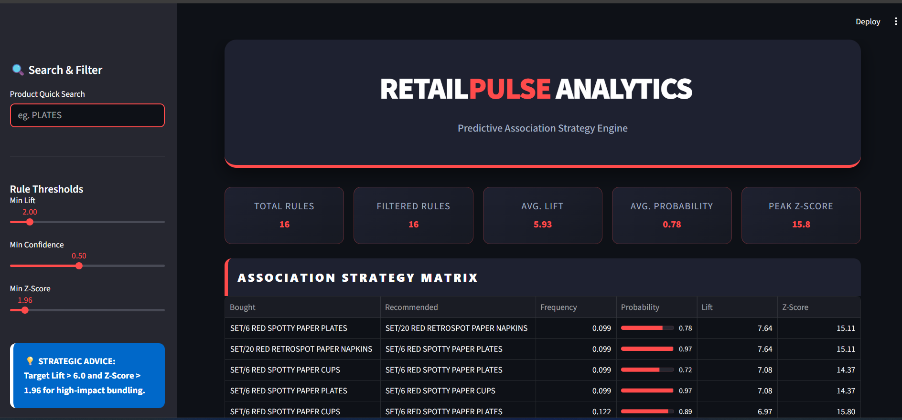
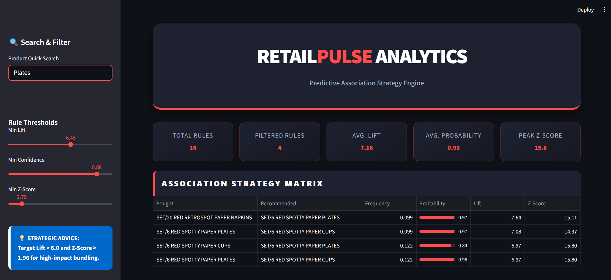
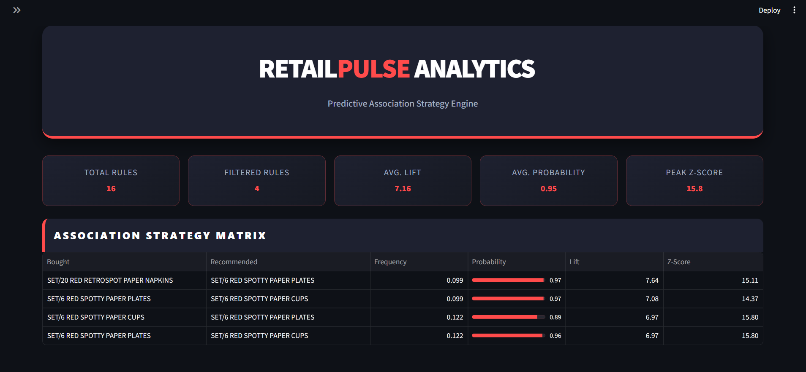

### 🛒 **RETAIL-PULSE-ANALYTICS-PREDICTIVE-ASSOCIATION-STRATEGY-ENGINE**


An end-to-end Market Basket Analysis (MBA) ecosystem that transforms raw transactional data into actionable cross-selling strategies. This project utilizes the Apriori and FP-Growth algorithms to identify high-probability product associations.

---

## Business Strategic Use Cases
This engine provides a statistically-backed framework for retail decision-making:

* **Evidence-Based Bundling**: Uses **Lift** and **Z-Score** to identify product pairs that truly belong together.
* **Inventory & Layout Optimization**: Provides data-driven insights for physical shelf placement and digital "Frequently Bought Together" recommendations.
* **Noise Reduction**: The **Rule Threshold** system allows stakeholders to filter out weak associations and focus only on high-impact retail strategies.


## Key Features

* **Automated Data Pipeline:** Cleans and transforms raw Excel/SQL retail data into a binary basket matrix.
* **Statistical Validation:** Computes Lift, Confidence, and Z-Score to ensure rules are statistically significant.
* **Dynamic Strategy Matrix:** Streamlit dashboard with real-time filtering for Lift and Confidence thresholds.
* **Network Visualization:** Interactive graph theory approach to visualize product relationships.

## Project Structure
* `app.py`: The main Streamlit dashboard featuring custom CSS branding.
* `Market Basket analysis demo.ipynb`: Detailed exploratory data analysis and algorithm testing.
* `validated_association_rules.csv`: The processed output used by the production dashboard.
* `data_extraction.sql`: Optimized SQL queries for enterprise data retrieval.

## Dashboard 
- Full view of the RetailPulse Engine showing initial state and high-level metrics.
---

---

## Filtering Functionality
- Real-time search and threshold adjustment demonstrating the dynamic nature of the Strategy Matrix.
---

---

## Strategy Matrix
- Enterprise-grade strategy matrix display with the sidebar collapsed for maximum visibility.
---

---

## Quick Start
To get this project running locally, follow these steps:

```bash
# Clone the repository
git clone <repo-url>

# Enter the project folder
cd <repo-folder>

# Install dependencies
pip install -r requirements.txt

# Launch the Dashboard
streamlit run app.py